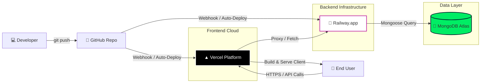

# 🚀 Deployment Architecture & CI/CD Pipeline

This document outlines the deployment strategy for the TrainrLocator application, utilizing **Vercel** for the frontend, **Railway** for the backend, and **MongoDB Atlas** for the database.

## 📦 Visual Deployment Overview



## 🛠️ Configuration Details

### 1. Frontend: Vercel
*   **Source**: Connected directly to the GitHub repository.
*   **Build Command**: `npm run build` (or `vite build`)
*   **Output Directory**: `dist`
*   **Environment Variables**:
    *   `VITE_API_BASE_URL`: Set to the Railway Backend URL (e.g., `https://trainr-backend-production.up.railway.app`).

### 2. Backend: Railway
*   **Source**: Connected directly to the GitHub repository.
*   **Build Command**: `npm install`
*   **Start Command**: `node server/server.js`
*   **Environment Variables**:
    *   `PORT`: Provided dynamically by Railway (usually `$PORT`).
    *   `MONGO_URI`: Connection string from MongoDB Atlas.
    *   `JWT_SECRET`: Secure secret for authentication.

### 3. Database: MongoDB Atlas
*   **Network Access**: specific IP whitelist (0.0.0.0/0 for Railway dynamic IPs or use peering if available).
*   **User Access**: Create a specific database user for Railway with read/write permissions.

## 🔄 CI/CD Automation Flow

1.  **Code Change**: You edit code locally and run `git push origin main`.
2.  **Trigger**: GitHub sends a webhook to both Vercel and Railway.
3.  **Frontend Build (Vercel)**:
    *   Vercel grabs the latest code.
    *   Runs `npm install` and `npm run build`.
    *   Deploys the static `dist` folder to its CDN edge network.
4.  **Backend Build (Railway)**:
    *   Railway grabs the latest code.
    *   Detects `package.json` and runs `npm install`.
    *   Starts the server using your start script.
    *   Health checks pass -> Service goes live.
5.  **Live**: The new version is instantly available to users.

## ⚠️ Key Considerations

*   **CORS**: Ensure your backend `server.js` allows the Vercel domain in its CORS configuration.
    ```javascript
    app.use(cors({ origin: 'https://your-project.vercel.app' }));
    ```
*   **Secrets**: never commit `.env` files. Always use the project settings panels in Vercel and Railway to set environment secrets.
