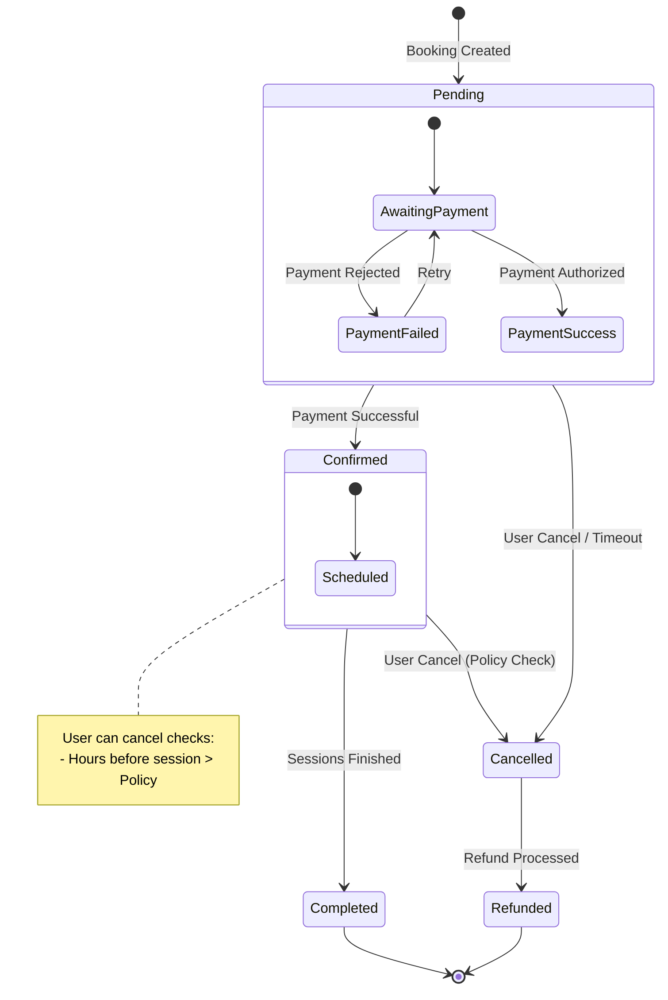
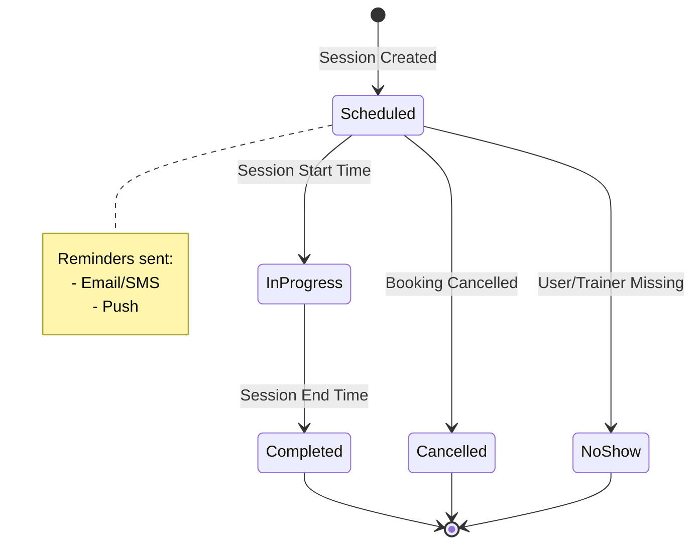
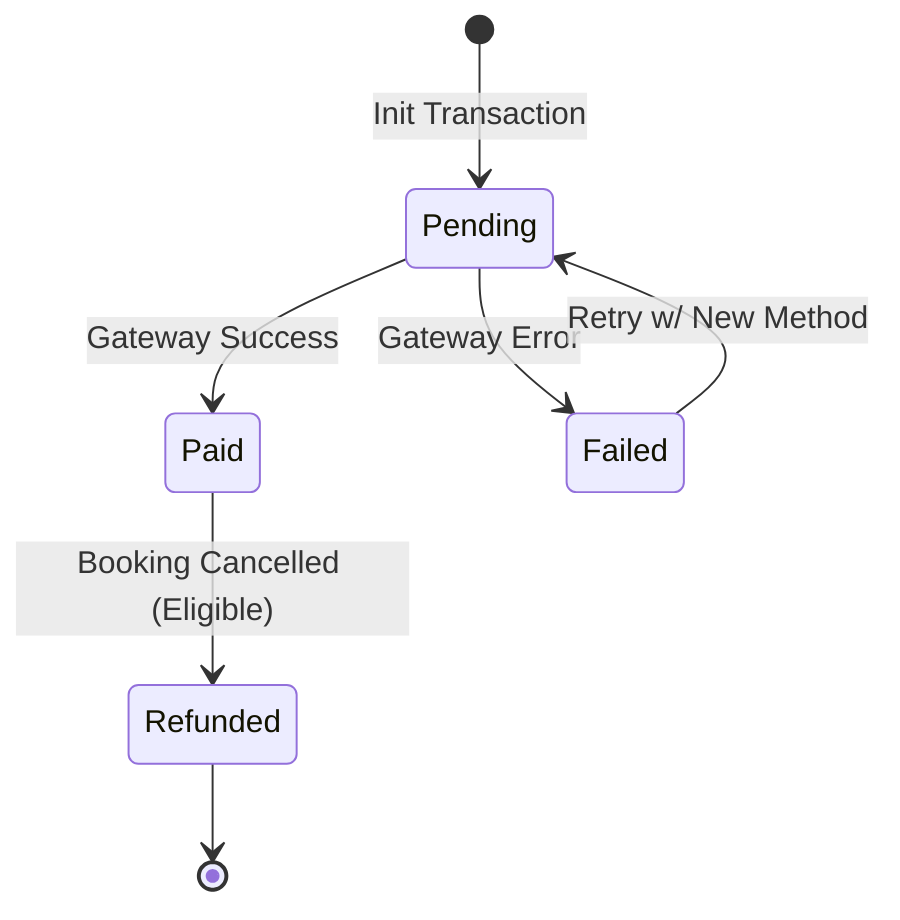

# System State Diagrams

## 1. Booking State Machine

This diagram represents the lifecycle of a `Booking` entity, including its interaction with the `Payment` status.

### Detailed Booking Transitions
| Current State | Event | New State | Condition |
|--------------|-------|-----------|-----------|
| `[*]` | Create Booking | `Pending` | User selects trainer & service |
| `Pending` | Payment Success | `Confirmed` | Payment gateway confirmation |
| `Pending` | Payment Fail | `Pending` | Retry allowed |
| `Pending` | Cancel | `Cancelled` | User aborts or timeout |
| `Confirmed` | Cancel | `Cancelled` | `canBeCancelled()` returns true |
| `Confirmed` | Complete | `Completed` | All sessions done |

---

## 2. Session Lifecycle

This diagram tracks the status of individual training sessions within a booking.

### Session State Transitions
| Current State | Event | New State | Notes |
|--------------|-------|-----------|-------|
| `[*]` | Booking Confirmed | `Scheduled` | created via `sessions` array |
| `Scheduled` | Time Arrives | `In-Progress` | |
| `Scheduled` | Cancellation | `Cancelled` | Propagates from Booking or individual reschedule |
| `Scheduled` | Absence | `No-Show` | Marked by Trainer |
| `In-Progress`| Fnishes | `Completed` | |

---

## 3. Payment State Flow

Focuses strictly on the financial transaction aspect of a Booking.

